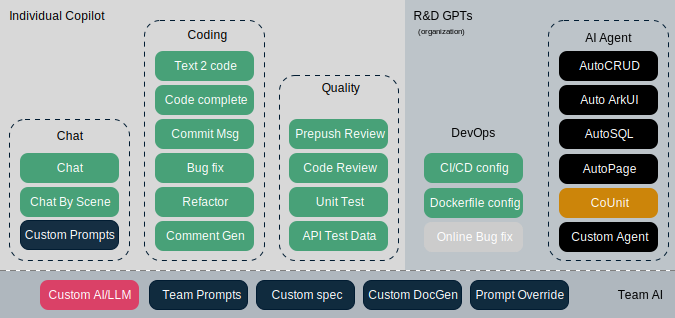

  

<h1 align="center">AutoDev for Intellij</h1>

  
  
    

> 🧙‍AutoDev: The AI-powered coding wizard with multilingual support 🌐, auto code generation 🏗️, and a helpful
> bug-slaying assistant 🐞! Customizable prompts 🎨 and a magic Auto Dev/Testing/Document/Agent feature 🧪 included! 🚀

VSCode Version: [https://github.com/unit-mesh/auto-dev-vscode](https://github.com/unit-mesh/auto-dev-vscode)

[Quick Start →](https://ide.unitmesh.cc/quick-start)

🆕🆕🆕: New AI agent language: [https://github.com/phodal/shire](https://github.com/phodal/shire)

## AutoDev 2.0 Sketch - the Cursor Composer in Intellij IDEA

Video demo (YouTube) — English

**AutoDev Sketch** is an IDE canvas feature provided by Shire, designed to simplify interactions and enhance the developer
experience within the IDE.

| Sketch Name            | Description                                                        | Screenshots                                              |
|------------------------|--------------------------------------------------------------------|----------------------------------------------------------|
| **Code Sketch**        | Real-time code editor with syntax highlighting                     |       |
| **Diff Sketch**        | Diff content comparison tool with patch handling                   |  |
| **Terminal Sketch**    | Editable pop-up terminal interface                                 |   |
| **Mermaid Sketch`*`**  | Real-time flowchart preview/edit with bidirectional binding        |    |
| **PlantUML Sketch`*`** | UML diagram editor with bidirectional code-diagram synchronization |   |
| **WebView Sketch**     | HTML/React/Ionic mockup generator with WebView display             |    |
                    
`*` means requires additional plugin installation.

### Unite Your Dev Ecosystem, Create Your AI Copilot

### Demos

Video demo (Bilibili) - 中文/Chinese

## AutoDev Architecture

Here is the AutoDev architecture:

## AutoDev 1.0~ Feature Overview

  

Features:

- Languages support: Java, Kotlin, JavaScript/TypeScript, Rust, Python, Golang, C/C++/OC (TBC), or others...
- Auto development mode
    - AutoCRUD (Spring framework）. With DevTi Protocol (like `devti://story/github/1102`) will auto
      generate Model-Controller-Service-Repository code.
    - AutoSQL (required Database plugin). Context-aware SQL generation.
    - AutoPage (React). Context-aware Web Page generation.
    - AutoArkUI (HarmonyOS). Auto generate HarmonyOS ArkUI code.
    - AutoTesting. create unit test intention, auto run unit test and try to fix test.
    - AutoDocument. Auto generate document.
- Copilot mode
    - AutoDev will help you find bug, explain code, trace exception, generate commits, and more.
    - Pattern specific. Based on your code context like (Controller, Service `import`), AutoDev will suggest the best
      code to you.
    - Related code. Based on recent file changes, AutoDev will call calculate similar chunk to generate the best code.
- Chat with AI. Chat with selection code and context-aware code.
- Customize.
    - Custom specification of prompt. For example, Controller, Service, Repository, Model, etc.
    - Custom intention action. You can add your own intention action.
    - Custom LLM Server. You can customize your LLM Server in `Settings` -> `Tools` -> `AutoDev`
    - Custom Living documentation. Customize your own living documentation, like annotation.
    - Team AI. Customize your team prompts in codebase, and distribute to your team.
    - Prompt override. You can override AutoDev's prompt in your codebase.
- SDLC
    - VCS. Generate/improve commit message, release note, and more.
    - Code Review. Generate code-review content.
    - Smart Refactoring. AI based Rename, refactoring with code smell, refactoring suggetion and more.
    - Dockerfile. Based on your project, generate Dockerfile.
    - CI/CD config. Based on build tool, generate CI/CD config file, like `.github/workflows/build.yml`.
    - Terminal. In Terminal ToolWindow, you can use custom input to generate shell/command
- Custom AI Agent
    - Executable AI Agent language: DevIns.
    - Custom AI Agent. You can integrate your own AI Agent into AutoDev.
- Model
    - Built-in LLM Fine-tune
    - [UnitEval](https://github.com/unit-mesh/unit-eval) evaluate llm result
    - [UnitGen](https://github.com/unit-mesh/unit-gen) generate code-llm fine-tune data.

AutoDev fine-tune models:

download from [HuggingFace](https://huggingface.co/unit-mesh)

| name          | model download (HuggingFace)                                    | model download (OpenBayes)                                                          |
|---------------|-----------------------------------------------------------------|-------------------------------------------------------------------------------------|
| DeepSeek 6.7B | [AutoDev Coder](https://huggingface.co/unit-mesh/autodev-coder) | AutoDev Coder](https://openbayes.com/console/phodal/models/rCmer1KQSgp/9/overview) |

## Language Features

### Language Support

We follow [Chapi](https://github.com/phodal/chapi) AST analysis engine for language support tier.

| Features                  | Java | Python | Go | Kotlin | JS/TS | C/C++ | C# | Scala | Rust | ArkTS |
|---------------------------|------|--------|----|--------|-------|-------|----|-------|------|-------|
| Chat Language Context     | ✅    | ✅      | ✅  | ✅      | ✅     | ✅     |    |       | ✅    | ✅     | 
| Structure AST             | ✅    |        | ✅  | ✅      | ✅     | ✅     |    |       |      |       | 
| Doc Generation            | ✅    | ✅      | ✅  | ✅      | ✅     |       |    |       | ✅    | ✅     | 
| Precision Test Generation | ✅    | ✅      | ✅  | ✅      | ✅     |       |    |       | ✅    |       | 
| Precision Code Generation | ✅    |        |    | ✅      |       |       |    |       |      |       | 
| AutoCRUD                  | ✅    |        |    | ✅      |       |       |    |       |      |       | 

### Extensions

see in [exts](exts)

## Demo

DevIns Language demo (Bilibili) - 中文

Video demo (YouTube) — English

Video demo (Bilibili) - 中文

## Useful Links

- [Copilot-Explorer](https://github.com/thakkarparth007/copilot-explorer) Hacky repo to see what the Copilot extension
  sends to the server.
- [GitHub Copilot](https://github.com/saschaschramm/github-copilot) a small part of Copilot Performance logs.
- [花了大半个月，我终于逆向分析了Github Copilot](https://github.com/mengjian-github/copilot-analysis)

## Who is using AutoDev?

Welcome to add your company here.

- Thoughtworks, a leading technology consultancy.

## License

Regarding the matter discussed in the LICENSE issue at the project's outset, we want to address the complexity of JetBrain plugin development. In the process, we referenced certain code and API designs from the JetBrains Community version and the JetBrains AI Assistant plugin. JetBrains understandably reserves the right to view this as potential infringement on their intellectual property.

Therefore, as of April 2024, AutoDev is no longer available on the JetBrains Plugin Marketplace. However, for older versions' AutoDev, you can access downloads from our Releases page. 

Additionally, we extend a warm invitation to participate in the development of the VSCode version. Your contributions are greatly appreciated.

- ChatUI based
  on: [https://github.com/Cspeisman/chatgpt-intellij-plugin](https://github.com/Cspeisman/chatgpt-intellij-plugin)
- Multiple target inspired
  by: [https://github.com/intellij-rust/intellij-rust](https://github.com/intellij-rust/intellij-rust)
- SimilarFile inspired by: JetBrains and GitHub Copilot
- DevIn Language refs
  on [JetBrains' Markdown Util](https://github.com/JetBrains/intellij-community/tree/master/platform/markdown-utils),
  which is licensed under the Apache 2.0 license.

**Known License issues**: JetBrain plugin development is no walk in the park! Oops, we cheekily borrowed some code from
the JetBrains Community version and the super cool JetBrains AI Assistant plugin in our codebase.
But fret not, we are working our magic to clean it up diligently! 🧙‍♂️✨.

Those codes will be removed in the future, you
can check it in `src/main/kotlin/com/intellij/temporary`, if you want to use this plugin in your company,
please remove those codes to avoid any legal issues.

This code is distributed under the MPL 2.0 license. See `LICENSE` in this directory.
