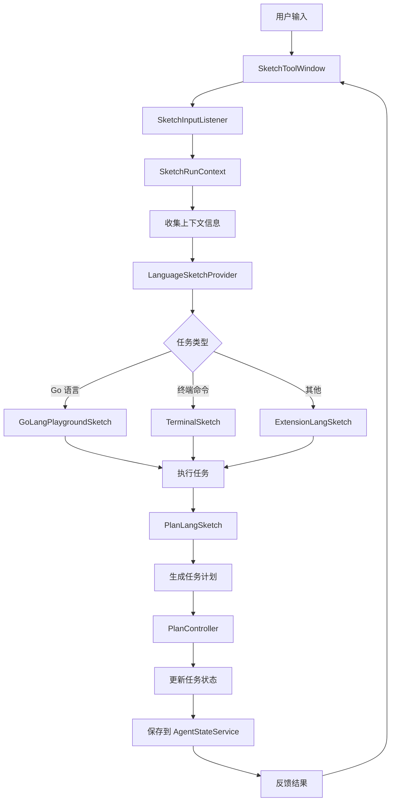

## How to use

1. Enable the MCP server in AutoDev settings
2. Use the MCP client to connect to the AutoDev server (We use JetBrains MCP Proxy Server to keep same protocol)

```json
{
  "mcpServers": {
    "AutoDev": {
      "command": "npx",
      "args": [
        "-y",
        "@jetbrains/mcp-proxy"
      ],
      "disabled": false,
      "autoApprove": []
    }
  }
}
```

### Test for Sketch call

工具列表：http://127.0.0.1:63342/api/mcp/list_tools

IDEA 相关 service 的端口在 63342~63352 之间，需要爱个尝试

#### 调用示例 1

```bash
➜  ~ curl -X POST "http://127.0.0.1:63343/api/mcp/issue_or_story_evaluate" \
     -H "Content-Type: application/json" \
     -d '{"issue": "添加根据作者删除博客"}'

{
    "status": "1. 在 `BlogRepository` 中添加根据作者删除博客的方法\n   - [*] 添加 `deleteByAuthor` 方法\n2. 在 `BlogService` 中添加根据作者删除博客的业务逻辑\n   - [*] 添加 `deleteBlogsByAuthor` 方法\n3. 在 `BlogController` 中添加根据作者删除博客的 API 端点\n   - [*] 添加 `DELETE /blog/author/{author}` 端点"
}
```

#### 调用示例 2

```bash
➜  ~ curl -X POST "http://127.0.0.1:63342/api/mcp/issue_or_story_evaluate" \
     -H "Content-Type: application/json" \
     -d '{"issue": "检索代码库，总结 Sketch 的工作流程"}'

{
    "status": "1. 定位核心工作流类\n   - [✓] 搜索包含 \"Workflow\" 和 \"Sketch\" 的类定义\n   - [✓] 分析 SketchRunner 的 execute 方法\n2. 解析 AI Flow 执行阶段\n   - [✓] 识别上下文收集阶段\n   - [✓] 分析工具调用决策模块\n   - [✓] 跟踪代码生成流水线\n3. 验证工作流程完整性\n   - [✓] 检查异常处理机制\n   - [✓] 确认版本控制集成点"
}
```

生成的 Plan 示例：

1. 定位核心工作流类
    - [✓] 搜索包含 "Workflow" 和 "Sketch" 的类定义
    - [✓] 分析 SketchRunner 的 execute 方法
2. 解析 AI Flow 执行阶段
    - [✓] 识别上下文收集阶段
    - [✓] 分析工具调用决策模块
    - [✓] 跟踪代码生成流水线
3. 验证工作流程完整性
    - [✓] 检查异常处理机制
    - [✓] 确认版本控制集成点

Mermaid for workflow:

