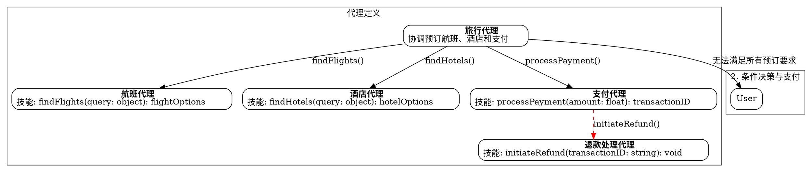

# Graphviz Diagram Extension

This extension provides support for viewing and editing Graphviz DOT files as interactive diagrams in IntelliJ IDEA.

Supported File Types:

- `.dot` files
- `.gv` files  
- `.graphviz` files

