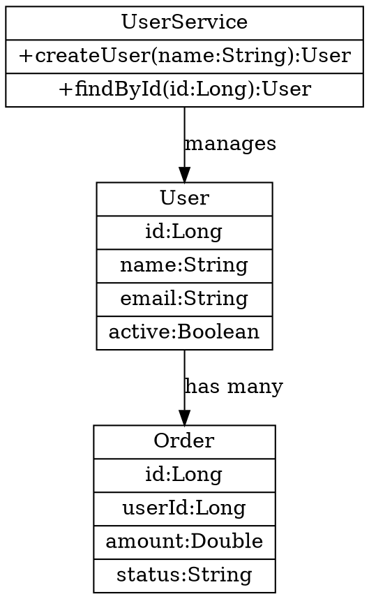
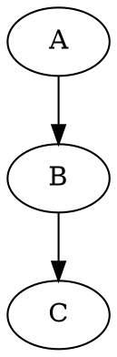
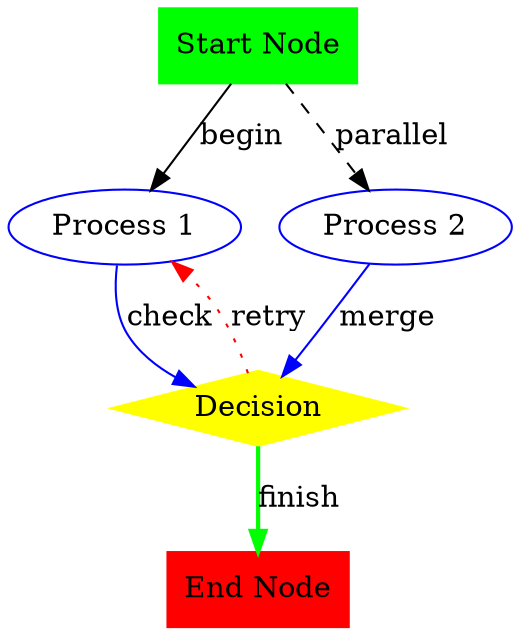

# Graphviz Diagram Extension

This extension provides support for viewing and editing Graphviz DOT files as interactive diagrams in IntelliJ IDEA.

## Features

- **DOT File Parsing**: Parse Graphviz DOT files using the `guru.nidi.graphviz-java` library
- **Interactive Diagrams**: Display DOT files as interactive diagrams with pan/zoom controls
- **Node and Edge Visualization**: Support for various node shapes, colors, and edge styles
- **Attribute Display**: Show node and edge attributes in the diagram
- **Split Editor**: Text editor with live preview panel for DOT files
- **File Type Support**: Automatic recognition of .dot, .gv, and .graphviz files
- **LangSketch Support**: Integration with AutoDev's LangSketch system for rendering DOT code blocks
- **IntelliJ Integration**: Seamlessly integrated with IntelliJ's diagram framework

## Supported File Types

- `.dot` files
- `.gv` files  
- `.graphviz` files

## Architecture

The extension is built following the JHipster UML module architecture and includes:

### Core Components

1. **GraphvizUmlProvider**: Main diagram provider that integrates with IntelliJ's diagram framework
2. **GraphvizDataModel**: Manages diagram data and handles file parsing
3. **GraphvizDiagramNode**: Represents individual nodes in the diagram
4. **GraphvizDiagramEdge**: Represents connections between nodes
5. **GraphvizElementManager**: Manages diagram elements and provides tooltips
6. **DotFileParser**: Parses DOT files using guru.nidi.graphviz library

### File Editor Components

1. **GraphvizPreviewFileEditor**: Preview editor for DOT files with live diagram rendering
2. **GraphvizPreviewFileEditorProvider**: Provider for the preview editor
3. **GraphvizEditorWithPreview**: Combined text editor and preview panel
4. **GraphvizSplitEditorProvider**: Provider for the split editor
5. **DotFileType**: File type definition for DOT files

### LangSketch Components

1. **GraphvizSketchProvider**: Language sketch provider for DOT files in AutoDev
2. **GraphvizSketch**: Sketch implementation that extends FileEditorPreviewSketch

### Data Models

- **GraphvizNodeData**: Base interface for all node data types
- **GraphvizSimpleNodeData**: Represents regular graph nodes with attributes
- **GraphvizEntityNodeData**: Represents entity nodes with fields/properties (similar to JHipster UML entities)
- **GraphvizNodeField**: Represents a field/property of an entity node
- **GraphvizDiagramRootData**: Represents the root DOT file
- **GraphvizEdgeData**: Represents edges/connections between nodes
- **GraphvizDiagramData**: Container for all diagram data

## Features

### Node Properties Support

The extension now supports parsing and displaying node properties/fields from Graphviz record-shaped nodes, similar to JHipster UML entities:



The parser automatically:
- Detects record-shaped nodes (`shape=record` or `shape=Mrecord`)
- Parses field definitions from the label (format: `{ClassName|field1:Type1|field2:Type2}`)
- Creates `GraphvizEntityNodeData` objects with `GraphvizNodeField` collections
- Supports port specifications (e.g., `<port1>fieldName:Type`)
- Falls back to simple nodes if no fields are found

## Usage

1. Open a `.dot`, `.gv`, or `.graphviz` file in IntelliJ IDEA
2. The file will be automatically recognized and opened with a split editor:
   - **Left panel**: Text editor for editing DOT source code
   - **Right panel**: Live preview of the diagram
3. Use the diagram view to:
   - Pan and zoom the diagram
   - View node and edge attributes
   - Navigate between connected nodes
4. Switch between editor modes using the toolbar:
   - **Editor only**: Show only the text editor
   - **Split view**: Show both editor and preview (default)
   - **Preview only**: Show only the diagram preview

### AutoDev LangSketch Integration

The extension also integrates with AutoDev's LangSketch system:

1. **Code Block Recognition**: DOT code blocks in markdown are automatically recognized
2. **Supported Languages**: `dot`, `graphviz`, `gv` language identifiers
3. **Live Rendering**: Code blocks are rendered as interactive diagrams in the AutoDev tool window
4. **Real-time Updates**: Diagrams update as you type in the code block

Example usage in AutoDev:

````markdown

````

## Example DOT File



## Dependencies

- `guru.nidi:graphviz-java:0.18.1` - For parsing DOT files
- `com.intellij.diagram` - IntelliJ's diagram framework

## Testing

Run tests with:
```bash
./gradlew :exts:ext-diagram:test
```

## Development

The extension follows IntelliJ plugin development best practices and is structured to be easily extensible for additional Graphviz features.
