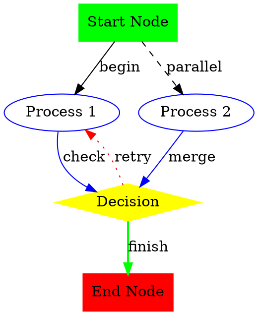

# Graphviz Diagram Extension

This extension provides support for viewing and editing Graphviz DOT files as interactive diagrams in IntelliJ IDEA.

## Features

- **DOT File Parsing**: Parse Graphviz DOT files using the `guru.nidi.graphviz-java` library
- **Interactive Diagrams**: Display DOT files as interactive diagrams with pan/zoom controls
- **Node and Edge Visualization**: Support for various node shapes, colors, and edge styles
- **Attribute Display**: Show node and edge attributes in the diagram
- **IntelliJ Integration**: Seamlessly integrated with IntelliJ's diagram framework

## Supported File Types

- `.dot` files
- `.gv` files  
- `.graphviz` files

## Architecture

The extension is built following the JHipster UML module architecture and includes:

### Core Components

1. **GraphvizUmlProvider**: Main diagram provider that integrates with IntelliJ's diagram framework
2. **GraphvizDataModel**: Manages diagram data and handles file parsing
3. **GraphvizDiagramNode**: Represents individual nodes in the diagram
4. **GraphvizDiagramEdge**: Represents connections between nodes
5. **GraphvizElementManager**: Manages diagram elements and provides tooltips
6. **DotFileParser**: Parses DOT files using guru.nidi.graphviz library

### Data Models

- **GraphvizNodeData**: Base interface for all node data types
- **GraphvizSimpleNodeData**: Represents regular graph nodes with attributes
- **GraphvizDiagramRootData**: Represents the root DOT file
- **GraphvizEdgeData**: Represents edges/connections between nodes
- **GraphvizDiagramData**: Container for all diagram data

## Usage

1. Open a `.dot`, `.gv`, or `.graphviz` file in IntelliJ IDEA
2. The file will be automatically recognized and can be viewed as a diagram
3. Use the diagram view to:
   - Pan and zoom the diagram
   - View node and edge attributes
   - Navigate between connected nodes

## Example DOT File



## Dependencies

- `guru.nidi:graphviz-java:0.18.1` - For parsing DOT files
- `com.intellij.diagram` - IntelliJ's diagram framework

## Testing

Run tests with:
```bash
./gradlew :exts:ext-diagram:test
```

## Development

The extension follows IntelliJ plugin development best practices and is structured to be easily extensible for additional Graphviz features.
