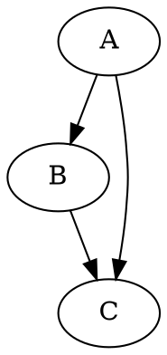
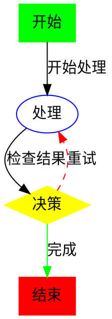
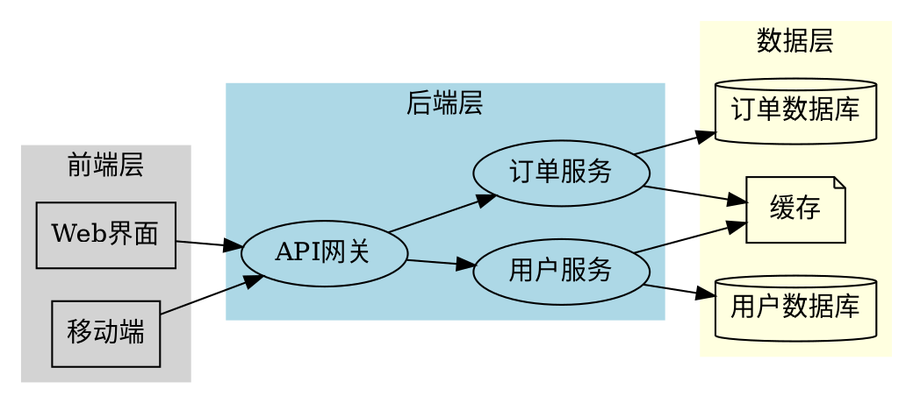

# Graphviz LangSketch 示例

这个文档展示了如何在 AutoDev 中使用 Graphviz LangSketch 功能。

## 简单的有向图



## 带属性的图表



## 无向图示例

```gv
graph UndirectedGraph {
    A -- B;
    B -- C;
    C -- D;
    D -- A;
    A -- C;
}
```

## 复杂的系统架构图



这些示例展示了 Graphviz LangSketch 支持的各种图表类型和语法。在 AutoDev 工具窗口中，这些代码块会被自动识别并渲染为交互式图表。
