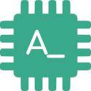

<p align="center">
  
</p>
<h1 align="center">AutoDev for VSCode (KMP Edition)</h1>
<p align="center">
    <a href="https://marketplace.visualstudio.com/items?itemName=Phodal.autodev">
        
    </a>
    <a href="https://github.com/unit-mesh/auto-dev-vscode/actions/workflows/ci.yml">
        
    </a>
</p>

> 🧙‍ AI-powered coding wizard with multilingual support 🌐, auto code generation 🏗️, and a helpful bug-slaying assistant 🐞! Built with **Kotlin Multiplatform** for cross-platform capabilities. 🚀

This is the **Kotlin Multiplatform (KMP) edition** of AutoDev, rewritten from the ground up to leverage Kotlin's cross-platform capabilities for future iOS, Android, and Desktop support.

## 🌟 Key Features

- **💬 Chat Mode**: Interactive AI assistant with context-aware code understanding
- **🔍 CodeLens**: Inline AI actions above functions and classes
  - Quick Chat, Explain Code, Optimize Code
  - Auto Comment, Auto Test, Auto Method
- **🧪 Auto Test Generation**: Generate unit tests with Tree-sitter AST parsing
- **📝 Auto Documentation**: Generate JSDoc/DocString comments
- **🔧 Code Actions**: Explain, optimize, and fix code with AI
- **🤖 Agent Support**: Extensible agent system via MCP (Model Context Protocol)
- **🌐 Multi-LLM Support**: OpenAI, Anthropic, Google, DeepSeek, Ollama, OpenRouter

## 🚀 Quick Start

1. **Install the Extension**: Search for "AutoDev" in VSCode Marketplace
2. **Configure LLM Provider**: Open Settings → AutoDev → Set your API key and model
3. **Start Coding**: Press `Cmd+Shift+A` (Mac) / `Ctrl+Shift+A` (Windows/Linux) to open chat

## 📖 Configuration

### LLM Provider Setup

```json
{
  "autodev.provider": "openai",
  "autodev.model": "gpt-4o-mini",
  "autodev.apiKey": "your-api-key-here"
}
```

### CodeLens Settings

```json
{
  "autodev.codelens.enable": true,
  "autodev.codelens.displayMode": "expand",
  "autodev.codelens.items": [
    "quickChat",
    "autoTest",
    "autoComment"
  ]
}
```

## 🏗️ Architecture (Kotlin Multiplatform)

This version is built with:

- **mpp-core**: Kotlin Multiplatform core library (shared logic)
- **mpp-vscode**: VSCode extension (TypeScript + mpp-core via JS bindings)
- **Tree-sitter**: Accurate code parsing for 8 languages (TS, JS, Python, Java, Kotlin, Go, Rust, etc.)
- **MCP Protocol**: Model Context Protocol for IDE server integration

### Project Structure

```
mpp-vscode/
├── src/                   # TypeScript extension code
│   ├── extension.ts       # Main entry point
│   ├── providers/         # CodeLens, Chat providers
│   ├── services/          # IDE Server, Diff Manager
│   └── commands/          # CodeLens commands
├── webview/               # React-based chat UI
├── dist/                  # Build output
│   └── wasm/              # Tree-sitter WASM files
└── scripts/               # Build scripts
```

## 🔌 Supported Languages

CodeLens and code parsing support:

- TypeScript/JavaScript (including React/TSX)
- Python
- Java
- Kotlin
- Go
- Rust

## 🛠️ Development

### Prerequisites

- Node.js 18+
- VSCode 1.77+

### Build from Source

```bash
# Install dependencies
cd mpp-vscode
npm install

# Build
npm run build

# Watch mode
npm run watch

# Package extension
npm run package
```

## 📚 Documentation

- **Official Docs**: [https://vscode.unitmesh.cc/](https://vscode.unitmesh.cc/)
- **JetBrains IDE Version**: [https://github.com/unit-mesh/auto-dev](https://github.com/unit-mesh/auto-dev)
- **Contributing**: [https://vscode.unitmesh.cc/development](https://vscode.unitmesh.cc/development)

## 🤝 Join the Community


If you are interested in AutoDev, you can join our WeChat group by scanning the QR code above.

（如果群二维码过期，可以添加我的微信号：`phodal02`，注明 `AutoDev`，我拉你入群）

## 📋 Feature Comparison

| Feature                | KMP Edition | Original VSCode |
|------------------------|-------------|-----------------|
| Chat mode              | ✅           | ✅               |
| CodeLens               | ✅           | ✅               |
| AutoDoc                | ✅           | ✅               |
| AutoTest               | ✅           | ✅               |
| Tree-sitter Parsing    | ✅           | ✅               |
| MCP Protocol           | ✅           | ❌               |
| Cross-platform Core    | ✅ (KMP)     | ❌               |
| iOS Support (Future)   | 🚧           | ❌               |
| Android Support (Future)| 🚧          | ❌               |

## 🎯 Roadmap

- [x] Basic Chat functionality
- [x] CodeLens with Tree-sitter
- [x] Auto Test/Doc/Method
- [x] Multi-LLM support
- [ ] Enhanced agent system
- [ ] iOS/Android support (via KMP)
- [ ] Desktop standalone app

## 📄 License

Apache-2.0

## 🙏 Acknowledgments

Built on the foundation of [AutoDev VSCode](https://github.com/unit-mesh/auto-dev-vscode), reimagined with Kotlin Multiplatform for next-generation cross-platform AI coding assistance.
